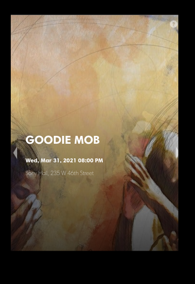
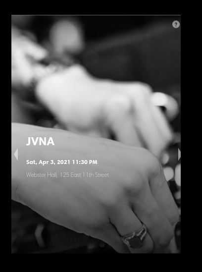

## MMM-TMWidget

* Ticketmaster API showing upcoming events

* Sports , Music, Arts, Theater, Film, All Events

## Examples






## Installation

* `git clone https://github.com/mykle1/MMM-TMWidget` into the `~/MagicMirror/modules` directory.

## Config.js entry and options

```
{
   disabled: false,
 module: "MMM-TMWidget",
 position: "middle_center",
 config: {
   apikey: "YOUR FREE API KEY", // get a free developers apiKey from ticketmaster.com
   keyword: "sports", // sports, arts, theater, film, all events
   latlong: "YOUR LATITUDE,YOUR LONGITUDE", // comma seperated
 }
},
```
